# Architecture

## System summary

Copilot Cockpit is a static multi-page site. Root HTML pages load shared CSS, sometimes load shared JavaScript, fetch JSON catalogs directly from `data/`, and render in the browser. There is no bundler, API server, SPA router, or server-side rendering layer in this repository.

## Repository-level architecture diagram

```mermaid
flowchart TD
    subgraph Pages
        IDX[index.html<br/>Cockpit]
        TERM[terminal.html]
        SEC[security.html]
        JB[jet-bridge.html]
        RAMP[ramp.html]
        RUN[runway.html]
        TWR[tower.html]
        LOG[flight-log.html]
        PREF[preflight.html]
        WIRE[wiring.html]
    end

    subgraph Shared_Runtime
        APP[app.js<br/>cockpit renderer]
        SEARCH[search.js<br/>global command palette]
        CSS[styles.css<br/>shared layout + theme]
        CDN[Mermaid + Prism + Google Fonts]
        VERCEL[Vercel static hosting<br/>cache headers]
    end

    subgraph JSON_Catalogs
        INST[copilot-instruments.json]
        MODELS[copilot-models.json]
        GOV[governance-controls.json]
        THREATS[security-threats.json]
        FRAMEWORKS[security-frameworks.json]
        SOVEREIGN[sovereign-cloud.json]
        TERMINAL[terminal-guide.json]
        JET[jet-bridge-guide.json]
        CHANGELOG[known-changelog-entries.json]
        PREFLIGHT[preflight-checklist.json]
        WIRING[wiring-diagram.json]
    end

    APP --> IDX
    SEARCH --> IDX
    SEARCH --> TERM
    SEARCH --> SEC
    SEARCH --> JB
    SEARCH --> RAMP
    SEARCH --> RUN
    SEARCH --> TWR
    SEARCH --> LOG
    SEARCH --> PREF
    SEARCH --> WIRE
    CSS --> Pages
    CDN --> Pages
    VERCEL --> Pages

    INST --> APP
    THREATS --> APP
    GOV --> APP
    MODELS --> APP

    TERMINAL --> TERM
    INST --> SEC
    THREATS --> SEC
    FRAMEWORKS --> SEC
    JET --> JB
    INST --> RAMP
    MODELS --> RUN
    GOV --> TWR
    MODELS --> TWR
    SOVEREIGN --> TWR
    CHANGELOG --> LOG
    PREFLIGHT --> PREF
    WIRING --> WIRE
    INST --> WIRE

    INST --> SEARCH
    GOV --> SEARCH
    MODELS --> SEARCH
    CHANGELOG --> SEARCH
```

## Shared runtime responsibilities

| File | Responsibility | Notes |
| --- | --- | --- |
| `app.js` | Bootstraps `index.html`, fetches cockpit data, derives indexes, renders the cockpit grid, detail blade, filters, cockpit-local search box behavior, theme toggle, Mermaid, Prism, and instrument deep links | Only external page controller in the repo |
| `search.js` | Builds an in-memory cross-page index from instruments, controls, models, and changelog entries; provides `Ctrl+K` or `Cmd+K` overlay navigation | Loaded on all root pages |
| `styles.css` | Shared tokens, layouts, HUD styling, theme handling, blades, tables, filters, and page-level components | Common dependency for all pages |

## Page responsibilities

| Page | Controller location | Fetches | Main runtime responsibility |
| --- | --- | --- | --- |
| `index.html` | `app.js` | instruments, threats, controls, models | Master cockpit view, filters, detail blade, cross-links to Security, Tower, and Runway |
| `terminal.html` | inline script | terminal guide | Plan selection, IDE setup, first-flight exercises, perspective departures |
| `security.html` | inline script | instruments, threats, framework registry | X-Ray scanner, framework chip resolution, posture checklist, `#scan=` routing |
| `jet-bridge.html` | inline script | jet-bridge guide | Prompt craft, context management, edit workflows, agent patterns |
| `ramp.html` | inline script | instruments | Ramp-specific subset where `perspectives` includes `ramp`; blade opens from `#instrument-<id>` |
| `runway.html` | inline script | models | Model fleet, plan/provider/status filtering, topology, NOTAMs, model blade, `#model-<id>` |
| `tower.html` | inline script | governance controls, models, sovereign cloud | Governance registry, sovereignty matrix, provider strategies, flight plans, hash-based highlighting |
| `flight-log.html` | inline script | changelog | Timeline grouping by year and filters by type and zone |
| `preflight.html` | inline script | pre-flight checklist | Checklist rendering, progress tracking, `localStorage` persistence, reset |
| `wiring.html` | inline script | wiring diagram, instruments | Derived Mermaid graph, connection filters, legend, zone cards, graph stats |

All pages except `index.html` embed their controller logic directly in the HTML file. That keeps deployment simple, but spreads behavior changes across multiple files.

## Standard boot sequence

The dominant page lifecycle is:

1. Load HTML and `styles.css`.
2. Read `localStorage['cockpit-theme']` and apply the light theme if present.
3. Fetch one or more JSON catalogs.
4. Render DOM sections from the fetched data.
5. Bind page-specific interactions such as filters, blades, or hash routing.
6. On most pages, replace the main content area with a `DATA LINK LOST` message if the primary fetch fails.

## Cockpit-specific architecture

`index.html` is the densest runtime surface:

1. `DOMContentLoaded` in `app.js` fetches:
   - `data/copilot-instruments.json`
   - `data/security-threats.json` as an optional enrichment
   - `data/governance-controls.json` as an optional enrichment
   - `data/copilot-models.json` as an optional enrichment
2. It derives:
   - `scannerIndex` from `threat.instrumentId`
   - `governanceIndex` from `control.id`
   - `_engineModels` from non-deprecated models
3. It renders 8 zones in a fixed order and treats the `eicas` and `fms` zones specially:
   - `eicas` renders model links rather than instrument cards
   - `fms` renders a fixed chain order for instruction and configuration instruments
4. It manages:
   - detail blade tabs
   - cockpit filter buttons
   - cockpit-local text filter
   - deep linking through `#instrument-<id>`
   - theme persistence via `cockpit-theme`

## Cross-page contracts

### URL hash contracts

| Consumer | Accepted hash | Effect |
| --- | --- | --- |
| `index.html` | `#instrument-<instrumentId>` | Opens the cockpit detail blade |
| `security.html` | `#scan=<instrumentId>` | Loads a specific scanner entry |
| `ramp.html` | `#instrument-<instrumentId>` | Opens the ramp blade |
| `runway.html` | `#model-<modelId>` | Opens the model blade |
| `tower.html` | `#control=<controlId>` | Highlights a governance control row |
| `tower.html` | `#sovereign=<deploymentOptionId>` | Highlights a sovereignty option |

These hashes are emitted by page-to-page links, `search.js`, cockpit callouts, and Wiring graph node click handlers.

### `localStorage` contracts

| Key | Owner | Shape | Scope |
| --- | --- | --- | --- |
| `cockpit-theme` | almost every page | `"light"` or `"dark"` | cross-page theme |
| `cockpit-last-scan` | `security.html` | instrument ID string | last selected security scan |
| `cockpit-security-posture` | `security.html` | JSON object of checkbox state | posture checklist |
| `copilot-preflight` | `preflight.html` | JSON object of checkbox state | onboarding checklist |

Filter state is intentionally not persisted on Cockpit, Runway, or Flight Log.

## Dependency and failure model

| Dependency | Required for | Failure effect |
| --- | --- | --- |
| JSON catalogs under `data/` | core rendering | page fails to render or shows a `DATA LINK LOST` banner |
| Mermaid CDN | diagrams on Cockpit, Security, Runway, Tower, Wiring | diagram sections degrade |
| Prism CDN | cockpit code tab highlighting | code still appears, but without syntax highlighting |
| Google Fonts | visual styling only | font fallback |
| Vercel Insights scripts | analytics | no effect on core content |

## Architecture risks

| Risk | Why it matters |
| --- | --- |
| Inline controller sprawl | Theme logic, rendering conventions, and error handling are duplicated across many HTML files |
| ID-centric linking | Renaming instrument, control, or model IDs breaks hashes, joins, search results, and persisted state |
| Partial data verification | `data/copilot-models.json` explicitly warns that some values are not yet fully verified |
| Minimal runtime validation | Browser code assumes catalog keys exist and are shaped correctly |
| External CDN reliance | Diagrams, code highlighting, and fonts are not fully self-hosted |

## Explicit assumptions

- The static architecture appears intentional because the repository contains direct HTML entry points, shared browser scripts, and `vercel.json`, but no build pipeline or generated output folder.
- Relative fetch paths such as `data/copilot-models.json` assume the site is served from the repository root or an equivalent static root.
