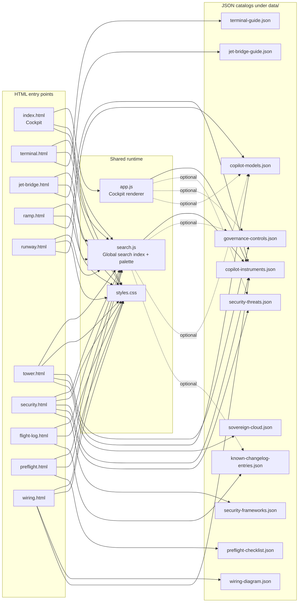

# Architektur

## 1. Verifiziertes Laufzeitmodell

`C:\temp\copilot-cockpit` ist eine **statische Multi-Page-Anwendung**:

- kein Backend
- kein API-Server
- kein Build-Artefaktverzeichnis
- kein Bundler oder Transpiler
- Rendering direkt im Browser aus `data\*.json`

Der Standardablauf ist pro Seite gleich:

1. Browser laedt eine HTML-Datei aus dem Repo-Root.
2. Die Seite bindet `styles.css` und optional gemeinsame Laufzeitdateien ein.
3. JavaScript laedt genau die benoetigten JSON-Dateien aus `data\`.
4. Das Skript rendert DOM-Strukturen clientseitig.
5. Hashes und `localStorage` konservieren Navigations- bzw. UI-Zustand.

## 2. Architekturdiagramm



## 3. Seiten-, Skript- und Daten-Topologie

| Ebene | Dateien | Technische Rolle |
| --- | --- | --- |
| Cockpit-Kern | `index.html` + `app.js` | Hauptgrid, Detailpanel, Filterleiste, Cross-Perspective-Callouts |
| Globale Suche | `search.js` | Baut den quellenuebergreifenden Suchindex und oeffnet die Command-Palette |
| Shared UI | `styles.css` | Layout, Thema, Karten, Blades, Suchpalette |
| Perspektivseiten | `terminal.html`, `jet-bridge.html`, `ramp.html`, `runway.html`, `tower.html`, `security.html`, `flight-log.html`, `preflight.html`, `wiring.html` | Page-lokale Renderpipelines fuer einzelne Themenbereiche |
| Datenkataloge | `data\*.json` | Kanonische Inhaltsquellen fuer Rendering und viele Cross-Page-Links |
| Tests | `tests\*.spec.js` | E2E- und Datenvertrags-Schutz fuer Rendering, Hashes und Referenzen |

## 4. Gemeinsame Laufzeitdateien

### 4.1 `app.js`

`app.js` ist **kein globales App-Framework**, sondern die spezialisierte Cockpit-Laufzeit fuer `index.html`.

Verifizierte Aufgaben:

- laedt `copilot-instruments.json` zwingend und weitere Kataloge optional
- rendert Zonen in fester Reihenfolge (`ZONE_ORDER`)
- behandelt `eicas` und `fms` als Spezialzonen
- oeffnet/schliesst das Detailpanel ueber `#instrument-<id>`
- erzeugt Cross-Page-Callouts nach `security.html`, `tower.html` und `runway.html`
- verwaltet Cockpit-Filter, In-Page-Suche, Theme und Browser-History

Wichtige Architekturfolge: Aenderungen in `app.js` betreffen nicht nur `index.html`, sondern auch alle Querverweise, die vom Detailpanel in andere Perspektiven fuehren.

### 4.2 `search.js`

`search.js` ist die einzige echte **querschnittliche Runtime-Datei** neben `styles.css`.

Verifizierte Aufgaben:

- laedt Instrumente, Controls, Modelle und Changelog-Eintraege
- behandelt Controls, Modelle und Changelog soft-fail
- erzeugt Navigationsziele direkt aus Hash-Kontrakten
- stellt `window.openGlobalSearch()` bereit
- wird von allen HTML-Seiten eingebunden

Architekturfolge: Jede Aenderung an IDs oder Hash-Schemata muss sowohl die Zieldatei als auch `search.js` mitdenken.

### 4.3 `styles.css`

`styles.css` ist der gemeinsame visuelle Vertrag fuer:

- Layout-Grids
- Karten und Blades
- Theme-Wechsel hell/dunkel
- Suchpalette
- Perspektivspezifische UI-Bloecke

Da es keinen komponentisierten CSS-Build gibt, wirken Stil-Aenderungen repo-weit.

## 5. Datenfluss und Kopplung

### 5.1 Primaerer Datenfluss

```text
HTML page -> JS bootstrap -> fetch(data/*.json) -> in-memory state -> rendered DOM
```

### 5.2 Cross-Page-Datenfluesse

| Quelle | Ziel | Technischer Vertrag |
| --- | --- | --- |
| Cockpit-Detailpanel | `security.html#scan=<instrumentId>` | Security-Scanner oeffnet zu genau diesem Instrument |
| Cockpit-Detailpanel | `tower.html#control=<instrumentId>` | Governance-Callout verlinkt in die Tower-Control-Liste |
| Cockpit-EICAS | `runway.html#model-<modelId>` | Modellchips springen in die Runway-Detailansicht |
| Wiring/Flight Log/Search | `index.html#instrument-<instrumentId>` | Instrument-Deep-Link oeffnet Cockpit-Detailpanel |
| Search | `tower.html#control=<controlId>` / `runway.html#model-<modelId>` | Suche verlinkt direkt in andere Perspektiven |

### 5.3 Soft-Fail vs. Hard-Fail

Verifiziert durch Code:

- `copilot-instruments.json` ist fuer das Cockpit Pflicht; bei Fehler zeigt `app.js` `DATA LINK LOST`.
- `security-threats.json`, `governance-controls.json` und `copilot-models.json` werden in `app.js` defensiv optional geladen.
- `search.js` baut seinen Index auch dann weiter, wenn optionale Kataloge fehlen.

Das reduziert Totalausfaelle, erzeugt aber auch "stille" Teildegradation: einzelne Callouts oder Suchsegmente koennen fehlen, obwohl die Seite bootet.

## 6. Persistenz- und Navigationsvertraege

### 6.1 Hash-Vertraege

| Seite | Eingehender Hash | Produzent(en) |
| --- | --- | --- |
| `index.html` | `#instrument-<id>` | `app.js`, `ramp.html`, `wiring.html`, `flight-log.html`, `search.js` |
| `ramp.html` | `#instrument-<id>` | `ramp.html` |
| `runway.html` | `#model-<id>` | `runway.html`, `search.js`, `app.js` |
| `security.html` | `#scan=<id>` | `security.html`, `app.js` |
| `tower.html` | `#control=<id>`, `#sovereign=<id>` | `tower.html`, `search.js`, `app.js` |

### 6.2 `localStorage`

| Key | Funktion |
| --- | --- |
| `cockpit-theme` | Persisitiert das Theme ueber mehrere Seiten hinweg |
| `cockpit-last-scan` | Merkt den zuletzt aktiven Security-Scan |
| `cockpit-security-posture` | Speichert Checkbox-/Posture-Zustand in `security.html` |
| `copilot-preflight` | Speichert Fortschritt der Pre-Flight-Checkliste |

## 7. Externe Laufzeitabhaengigkeiten

Im Repo selbst liegen nicht alle Runtime-Bausteine:

- Google Fonts fuer die Typografie
- Mermaid CDN fuer Diagramm-Rendering
- Prism CDN fuer Syntax-Highlighting
- Vercel Insights / Speed Insights Skripte

Das Repo ist also statisch, aber nicht komplett offline-selbstgenuegsam.

## 8. Aenderungsfolgen fuer Maintainer

| Wenn du aenderst ... | Revalidiere mindestens ... | Warum |
| --- | --- | --- |
| `app.js` | Cockpit, Security-Callout, Tower-Callout, Runway-Bridge, Hash-Verhalten | Das Cockpit ist Integrationshub fuer mehrere Perspektiven. |
| `search.js` | globale Suche, Ziel-Hashes, Instrument-/Control-/Model-IDs | Die Suche kodiert Ziel-URLs direkt. |
| `data\copilot-instruments.json` | Cockpit, Ramp, Security, Wiring, Flight Log, Search, `integrity.spec.js` | Instrument-IDs sind Referenzanker ueber das gesamte Repo. |
| `data\copilot-models.json` | Runway, Tower, Cockpit-EICAS, Search | Modell-IDs und Verfuegbarkeiten propagieren in mehrere Seiten. |
| `data\governance-controls.json` | Tower, Search, Cockpit-Governance-Callouts, Wiring | Controls sind Ziele fuer Hashes und Graph-Kanten. |
| Deep-Link-Logik | alle betroffenen Seiten + Search + Playwright | Hashes sind kein Beiwerk, sondern Vertrag. |

## 9. Im Repo nicht explizit belegt

1. **Deploy-Trigger und Rollback-Prozess.** `vercel.json` zeigt die Auslieferungsform, nicht aber wer oder was deployt.
2. **Zentrales Incident-Handling.** Das Repo zeigt Fehlerbilder im Browser und Testschutz, aber kein eigenes Alerting-/Monitoring-System.

Diese Punkte gehoeren deshalb nach [OPERATIONS.md](OPERATIONS.md) nur als Annahmen oder Lueckenbeschreibung, nicht als harte Behauptung.
