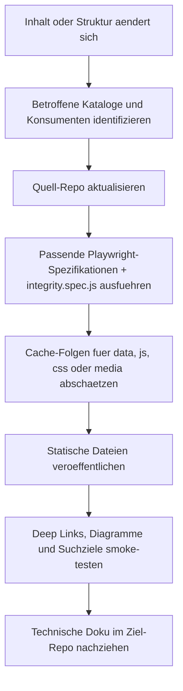

# Operations

## 1. Betriebsmodell

Das Quell-Repo wird als **statische Website** betrieben. Operativ entscheidend sind deshalb nicht Deploy-Artefakte, sondern:

1. gueltige HTML-/JS-/CSS-Dateien
2. konsistente JSON-Kataloge
3. intakte externe CDN-Abhaengigkeiten
4. realistische Cache-Erwartungen

## 2. Verifizierter Deployment-Vertrag

`vercel.json` belegt:

| Einstellung | Wert | Bedeutung |
| --- | --- | --- |
| `framework` | `null` | kein Framework-spezifischer Buildmodus |
| `buildCommand` | leer | kein Build-Schritt im Repo konfiguriert |
| `outputDirectory` | `.` | Root-Dateien werden direkt ausgeliefert |
| Header fuer `/data/*` | `public, max-age=3600, must-revalidate` | Datenaktualisierungen koennen bis zu 1 Stunde gecacht werden |
| Header fuer `/*.js` und `/*.css` | `public, max-age=3600, must-revalidate` | Runtime- und Stil-Aenderungen sind nicht instant ungecached |
| Header fuer `/media/*` | `public, max-age=31536000, immutable` | Medien brauchen strenge Dateidisziplin |

## 3. Externe Laufzeitabhaengigkeiten

| Abhaengigkeit | Beobachteter Einsatz | Risiko bei Ausfall |
| --- | --- | --- |
| Google Fonts | Typografie in Seiten-Head-Sektionen | Layout-/Branding-Abweichungen |
| Mermaid CDN | Diagramme in mehreren Perspektiven | Diagramme fehlen oder rendern nicht |
| Prism CDN | Syntax-Highlighting im Cockpit | Codebloecke bleiben funktional, aber weniger lesbar |
| Vercel Insights Skripte | am Seitenende eingebunden | keine Einflussnahme auf Kernfunktion, aber fehlende Telemetrie |

## 4. Content-Refresh-Runbook

## 5. Typische Aenderungsarten und ihre Betriebsfolgen

| Aenderung | Hauptfolgen | Erste Revalidierung |
| --- | --- | --- |
| neues oder geaendertes Instrument | Cockpit, Ramp, Wiring, Search, Flight Log, Security | `integrity.spec.js`, `cockpit.spec.js`, betroffene Perspektive |
| neues/veraendertes Modell | Runway, Tower, Cockpit-EICAS, Search | `runway.spec.js`, `tower.spec.js`, `integrity.spec.js` |
| neue Governance-Control | Tower, Search, Wiring, Cockpit-Callout | `tower.spec.js`, `integrity.spec.js` |
| Mermaid-Aenderung | Tower, Security, Wiring oder Runway | betroffene Seitenspezifikation plus visueller Smoke-Test |
| Medienaenderung unter `media\` | stark gecachte Assets | Dateiname/Pfad und Cache-Verhalten mitdenken |

## 6. Cache- und Ausrollhinweise

### 6.1 JSON, JS und CSS

- Cache-Horizont: 1 Stunde
- Verhalten: `must-revalidate`
- Konsequenz: Nach Deploys koennen Nutzer kurzfristig noch alten Inhalt sehen, vor allem bei Datenkorrekturen.

### 6.2 Medien

- Cache-Horizont: 1 Jahr
- Verhalten: `immutable`
- Konsequenz: Ersetze Medien nicht stillschweigend unter identischem Pfad, wenn der neue Inhalt sofort sichtbar sein muss.

## 7. Triage fuer haeufige Stoerbilder

| Symptom | Erste Pruefung | Wahrscheinliche Ursache |
| --- | --- | --- |
| Seite zeigt `DATA LINK LOST` | existiert die geladene JSON-Datei und ist sie gueltiges JSON? | Pflichtkatalog fehlt oder ist syntaktisch kaputt |
| nur Suchtreffer fehlen | `search.js`-Quellen und Ziel-IDs pruefen | optionaler Katalog fehlt oder ID-Drift |
| Diagramm bleibt leer | Mermaid-Quelle und CDN-Erreichbarkeit pruefen | Diagrammsyntax oder CDN-Ausfall |
| Deep Link oeffnet nichts | Hash-Schema und Ziel-ID pruefen | ID-Drift oder geaenderte Hash-Logik |
| nur eine Perspektive ist defekt | page-lokales Inline-Skript und Zielkatalog pruefen | isolierter Seitenfehler statt Systemausfall |

## 8. Betriebsrisiken, die direkt aus dem Repo ableitbar sind

| Risiko | Warum relevant |
| --- | --- |
| ID-Brueche in Hub-Katalogen | mehrere Seiten und Tests referenzieren dieselben IDs |
| verifikationspflichtige Kataloge | Models und Security-Frameworks markieren Unsicherheit explizit selbst |
| duplizierte Theme-/Boot-Logik | page-lokale Skripte koennen funktional driften |
| CDN-Abhaengigkeit | statische Site bleibt fuer gewisse Features von externen Skripten abhaengig |
| fehlender Build-Schritt | viele Probleme schlagen erst zur Laufzeit oder in E2E-Tests auf |

## 9. Was im Repo fuer Betrieb nicht explizit dokumentiert ist

| Thema | Status |
| --- | --- |
| formaler Deploy-Trigger | nicht im Repo belegt |
| Rollback-Prozess | nicht im Repo belegt |
| Alerting / Monitoring ausserhalb des Browsers | nicht im Repo belegt |
| SLA fuer Content-Aktualitaet | nicht im Repo belegt |

Diese Punkte sollten als **Annahme oder Betriebsentscheidung ausserhalb des Repos** behandelt werden.

## 10. Release-Checkliste fuer Maintainer

1. Betroffene Daten-/UI-Dateien im Quell-Repo aendern.
2. Passende Spezifikationen gemaess [TESTING-GUIDE.md](TESTING-GUIDE.md) auswaehlen.
3. Hashes, Search-Ziele und Mermaid-Ausgaben gezielt smoke-testen.
4. Cache-Auswirkungen fuer `data\`, `*.js`, `*.css` und `media\` bewerten.
5. Technische Doku hier aktualisieren, wenn Architektur, Vertrage, Counts oder Wartungshinweise betroffen sind.
